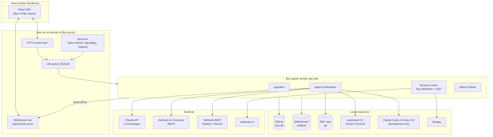
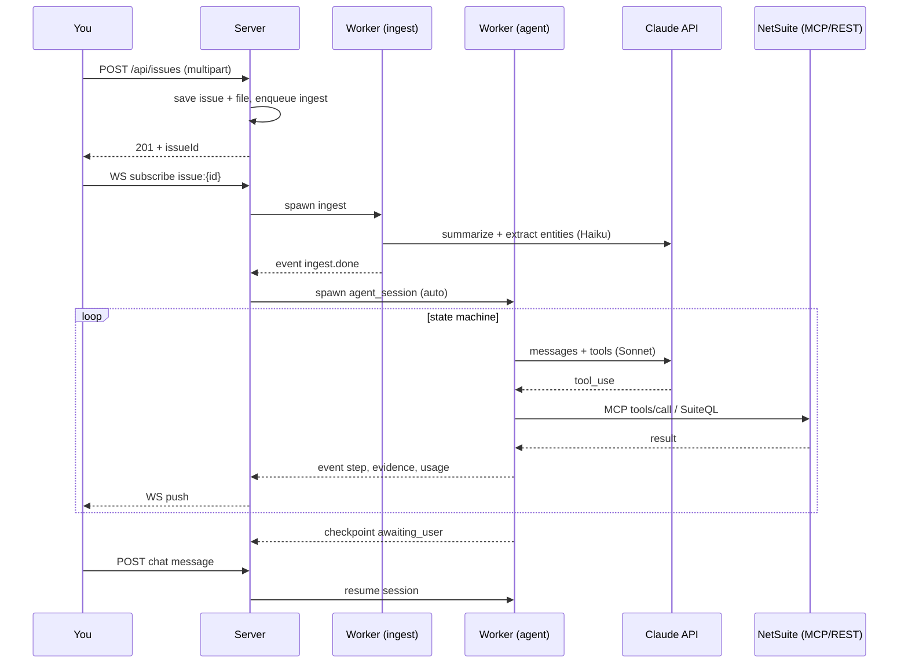
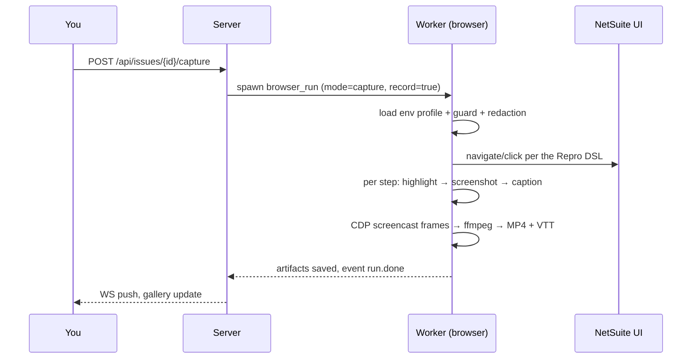

# 02 · System Architecture

## 1. Big picture

NSIC runs as **one Bun server process** + **worker processes** spawned per heavy job.
All state lives in SQLite (`data/nsic.db`, WAL mode) and the filesystem (`data/`).



## 2. Process model

| Process | Responsibility | Reason for separation |
|---|---|---|
| `server` | HTTP, WebSocket, queue dispatcher, `Bun.cron` | Must always stay responsive |
| `worker` (spawned per job) | ingestion, agent session, browser run, report | A crash/leak in one job doesn't take down the server; easy to kill (cancel) |

- Workers are spawned with `Bun.spawn(["bun", "src/worker.ts", jobId], { ipc })` and the `--no-orphans`
  flag so they die along with the server.
- Worker → server communication happens over **IPC** (`process.send`); the server forwards it to the
  WebSocket topic `issue:{id}` with `server.publish()`.
- Default concurrency: 2 agent workers + 1 browser worker (the browser is heavy and needs an exclusive session per environment).

## 3. Job queue in SQLite

The `jobs` table (see doc 04). The server-side dispatcher:

1. Every 500 ms (or on an internal `NOTIFY` after an insert), pick up the highest-priority `queued` job
   for which a slot of that type is available.
2. Set `status='running'`, `lease_until = now + 60s`, spawn a worker.
3. The worker updates a heartbeat every 15 seconds (extending `lease_until`).
4. On server startup: any `running` job with an expired lease goes back to `queued` (resuming from its last step).

Job types: `ingest`, `index_repo`, `probe_env`, `agent_session`, `browser_run`, `record_video`,
`build_report`, `sdf_deploy_sandbox`, `poll_logs`.

## 4. Application folder structure

```
nsic/
├─ package.json            # deps: react, react-dom
├─ bunfig.toml
├─ tsconfig.json
├─ .env                    # NSIC_MASTER_KEY, ANTHROPIC_API_KEY, PORT
├─ DESIGN.md
├─ AGENTS.md
├─ src/
│  ├─ server.ts            # Bun.serve: routes, websocket, static, HTML import
│  ├─ worker.ts            # worker entry point: dispatch per job type
│  ├─ config.ts
│  ├─ db/
│  │  ├─ schema.sql
│  │  ├─ migrate.ts        # PRAGMA user_version based
│  │  └─ repo/*.ts         # query functions per table (no ORM)
│  ├─ routes/              # /api/* handlers
│  ├─ realtime/            # topics, event types, IPC bridge
│  ├─ jobs/                # queue.ts, dispatcher.ts, cron.ts
│  ├─ llm/
│  │  ├─ anthropic.ts      # fetch /v1/messages, SSE parser, retry
│  │  ├─ cli.ts            # development Claude Code and Codex runners
│  │  ├─ usage.ts          # token & cost tracking
│  │  └─ cache.ts          # prompt caching strategy
│  ├─ agent/
│  │  ├─ orchestrator.ts   # state machine loop
│  │  ├─ states/*.ts       # triage, investigate, hypothesize, reproduce, ...
│  │  ├─ tools/*.ts        # tool registry + implementations
│  │  ├─ context.ts        # context assembly from the evidence board
│  │  ├─ evidence.ts
│  │  └─ budget.ts
│  ├─ netsuite/
│  │  ├─ oauth-pkce.ts     # Authorization Code + PKCE (MCP)
│  │  ├─ m2m-jwt.ts        # client credentials + JWT assertion (REST)
│  │  ├─ mcp-client.ts     # minimal Streamable HTTP JSON-RPC client
│  │  ├─ suiteql.ts
│  │  ├─ sdf.ts            # suitecloud CLI wrapper (Bun.Terminal / Bun.$)
│  │  └─ error-patterns.ts
│  ├─ repo/
│  │  ├─ git.ts            # Bun.$ git ...
│  │  ├─ indexer.ts
│  │  └─ sdf-parser.ts     # Bun.XML for Objects/*.xml, JSDoc tags for scripts
│  ├─ browser/
│  │  ├─ session.ts        # Bun.WebView lifecycle, profile, cookies via CDP
│  │  ├─ login-assist.ts
│  │  ├─ dsl.ts            # Repro DSL types & validation
│  │  ├─ runner.ts         # step execution, screenshot, highlight
│  │  ├─ guard.ts          # production guard
│  │  ├─ redact.ts
│  │  └─ recorder.ts       # CDP screencast → frames → ffmpeg
│  ├─ ingest/              # image.ts, pdf.ts, docx.ts, xlsx.ts, csv.ts, eml.ts, text.ts
│  ├─ reports/
│  │  ├─ model.ts          # ReportModel from the DB
│  │  ├─ html.ts           # render HTML (template + tokens.css)
│  │  ├─ pdf.ts            # CDP Page.printToPDF
│  │  └─ xlsx.ts           # minimal XLSX writer
│  └─ lib/
│     ├─ zip.ts            # ZIP reader/writer (deflate-raw + Bun.hash.crc32)
│     ├─ crypto.ts         # AES-GCM envelope
│     ├─ ids.ts            # Bun.randomUUIDv7
│     ├─ log.ts            # JSONL logger
│     └─ result.ts
├─ web/
│  ├─ index.html           # imported by the server (Bun HTML import)
│  ├─ main.tsx
│  ├─ app/                 # simple routing (URLPattern), pages, components
│  ├─ styles/
│  │  ├─ tokens.css        # generated from DESIGN.md
│  │  └─ app.css
│  └─ fonts/               # Geist Sans & Mono (OFL), self-hosted
├─ tests/                  # bun test
└─ data/                   # .gitignore
   ├─ nsic.db
   ├─ issues/{issueId}/
   │  ├─ attachments/
   │  ├─ derived/          # extracted text, thumbnails
   │  ├─ screenshots/{runId}/
   │  ├─ videos/{runId}/
   │  ├─ repro/            # repro script versions
   │  └─ reports/
   ├─ profiles/{envId}/    # per-environment Chrome profile (login assist)
   ├─ repos/{repoId}/      # clone if the repo comes from a URL
   └─ logs/{sessionId}.jsonl
```

## 5. End-to-end flow: a new issue



## 6. Final capture & recording flow



## 7. Architectural principles

1. **Deterministic at the edges, AI in the middle.** Parsing, the runner, the guard, and exports are written deterministically; the LLM only decides on steps and writes narrative.
2. **Light event sourcing.** Every agent step is stored as `agent_steps` + `tool_calls`; the UI is a projection of those tables.
3. **Idempotent & resumable.** Every step has an `idempotency_key`; a restarted worker resumes from the last step marked `done`.
4. **Least privilege per tool.** Tools declare `risk` and `allowedEnvKinds`; the registry filters before sending them to the model.
5. **Secrets never cross a boundary.** Credentials are decrypted only inside the `netsuite/*` module at request time, and are never put into a prompt or a log.
