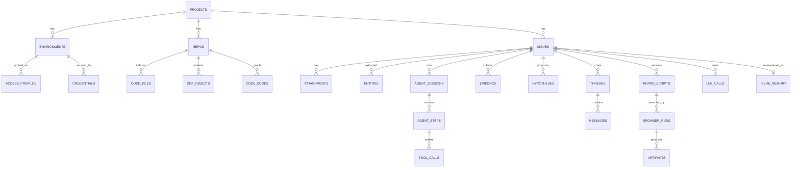

# 04 · Data Model

The full DDL lives in `schema/schema.sql`. This document explains the relations, conventions, and access rules.

## 1. ERD



## 2. Conventions

| Aspect | Rule |
|---|---|
| ID | `Bun.randomUUIDv7()` (time-ordered, index-friendly) |
| Time | INTEGER epoch ms UTC; converted to the NetSuite account's timezone in the UI using `Temporal` |
| JSON | TEXT + `CHECK (json_valid(...))`; queried with `json_extract` |
| Large files | Not stored in the DB. The DB stores `storage_path` relative to `data/` |
| Deletion | Deleting an issue cascades to all descendants + the `data/issues/{id}` folder is removed by a cleanup job |
| Migrations | Files at `src/db/migrations/NNN_*.sql`; `PRAGMA user_version` as the version; run at server start inside one transaction |
| DB access | One module per table in `src/db/repo/`; prepared statements via `db.query()` (cached by Bun); no ORM |
| Concurrency | WAL + `busy_timeout`; the server is the main writer, workers write through their own connections (SQLite is safe for multi-process access with WAL) |

## 3. Key tables and why

- **`access_profiles`** stores the probe history, not just the latest status. An agent session stores the
  `access_profile_id` it used, so the agent's decisions can be audited ("MCP wasn't active at that point").
- **`credentials`** stores only ciphertext + iv + `key_version` (supports master key rotation). See doc 06 §5.
- **`code_edges`** is a simple dependency graph. Nodes are prefixed (`obj:`, `file:`, `rec:`, `fld:`, `wf:`).
  A query like "what runs on Sales Order" is a traversal from `rec:salesorder` through `applies_to` and `deploys`.
- **`agent_steps` + `tool_calls`** form the event log. The UI timeline and the context builder read from here.
  Large tool output (e.g. a 5,000-row SuiteQL result) is written to a file, with the DB storing a preview + path.
- **`evidence.private`** flags evidence that must never be surfaced to the consultant assistant or a report
  (e.g. internal usernames, your personal notes).
- **`llm_calls.pricing_snapshot`** stores the price at the time the call happened, so historical cost doesn't change when pricing in Settings is edited later.
- **`issue_memory`** is populated automatically when an issue becomes `resolved` (summarized by Haiku), and is the source for the `find_similar_issues` tool.

## 4. Example queries

Scripts active on a given record type:

```sql
SELECT o.scriptid, o.object_type, json_extract(o.attrs,'$.status') AS status, f.path, f.entry_points
FROM code_edges e
JOIN sdf_objects o ON o.repo_id = e.repo_id AND e.src = 'obj:' || o.scriptid
LEFT JOIN code_edges impl ON impl.repo_id = e.repo_id AND impl.src = e.src AND impl.rel = 'implements'
LEFT JOIN code_files f ON f.repo_id = e.repo_id AND 'file:' || f.path = impl.dst
WHERE e.repo_id = ?1 AND e.dst = 'rec:' || ?2 AND e.rel = 'applies_to';
```

Cost per issue this month:

```sql
SELECT i.key, i.title, u.cost_usd, u.input_tokens + u.output_tokens AS tokens
FROM v_issue_usage u JOIN issues i ON i.id = u.issue_id
WHERE i.created_at >= ?1 ORDER BY u.cost_usd DESC;
```

## 5. Retention & backup

| Data | Default retention |
|---|---|
| Raw screencast frames | Deleted once the MP4 is produced |
| Session JSONL logs | 90 days |
| Artifacts of closed issues | Forever (until the issue is deleted) |
| Backup | `VACUUM INTO 'data/backup/nsic-YYYYMMDD.db'` daily via `Bun.cron`, keeping the last 14 |
