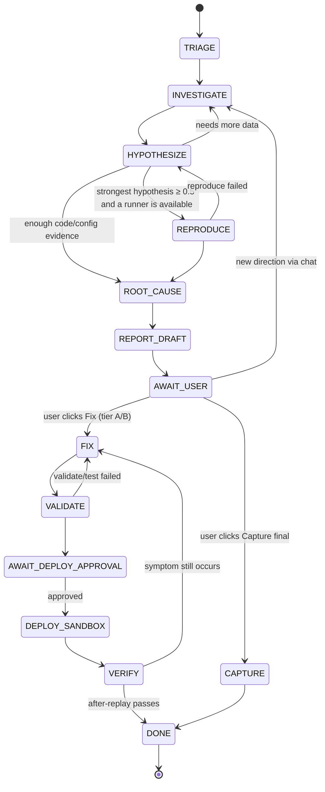

# 05 · Agent Design

## 1. Principles

1. **An explicit state machine, not a free-form loop.** Every state has a goal, allowed tools, completion criteria, and an iteration limit.
2. **Evidence-first.** A claim without evidence stays a hypothesis. A root cause may only be written once there's evidence ≥ E4, or E3 plus an explicit note about access limitations.
3. **Context = the evidence board, not the transcript.** Every LLM call is reassembled from structured data (issue, entities, evidence, hypotheses, a summary of the last steps).
4. **Tier-aware.** Tools unavailable under the Access Profile are never sent to the model.
5. **Human checkpoints at risky points**: before a sandbox deploy, before a final capture, whenever access or a decision is needed.

## 2. Evidence level

| Level | Name | Requirement |
|---|---|---|
| E0 | Unverified | Nothing exists yet besides the issue |
| E1 | Reported | A structured client report (entities extracted, symptoms clear) |
| E2 | Observed | Confirmed in NetSuite data/logs (SuiteQL, execution log, audit trail, system notes) |
| E3 | Reproduced | Successfully reproduced by the runner (sandbox) or re-observed read-only (production) |
| E4 | Root-caused | The cause is pinned to specific code/configuration (file:line, SDF object, workflow state, permission) + the mechanism is explained |
| E5 | Verified fix | The fix is applied in sandbox; the "after" replay no longer shows the symptom; tests/validation pass |

`issues.evidence_level` = the highest level among evidence marked `confirmed` or `proposed` that hasn't been rejected.

## 3. State machine



Every state can also transition into `AWAIT_USER` (checkpoint), `BLOCKED` (insufficient access), or `BUDGET_EXCEEDED`.

| State | Goal | Model | Max LLM iterations | Required output |
|---|---|---|---|---|
| TRIAGE | Category, severity, module, environment, investigation plan | Haiku | 1 | `triage` JSON + a 3-7 step plan |
| INVESTIGATE | Gather data per the plan | Sonnet | 12 per round | New evidence (E1/E2) |
| HYPOTHESIZE | Build/revise hypotheses + confidence | Sonnet | 2 | Ranked hypothesis list |
| REPRODUCE | Write a Repro DSL script, run in `reproduce` mode | Sonnet | 4 | `browser_run` + E3 evidence or a failure reason |
| ROOT_CAUSE | Pin down the specific cause | Sonnet (escalate to Opus) | 4 | E4 evidence + mechanism explanation |
| REPORT_DRAFT | Summary for you & a report draft | Sonnet | 1 | `issues.root_cause` draft |
| FIX | Patch on branch `nsic/{issueKey}` | Sonnet (optional Opus review) | 8 | Diff + rationale |
| VALIDATE | Unit tests + `suitecloud project:validate` | — (deterministic) | — | Test/validate results |
| DEPLOY_SANDBOX | Deploy with an explicit `deploy.xml` | — | — | Deploy result |
| VERIFY | Replay `verify_after` | — + Sonnet to assess | 2 | E5 evidence or failure |
| CAPTURE | Replay in `capture` mode + record | — | — | Screenshots, video, captions |

**Escalation-to-Opus rule:** the agent calls the `request_escalation(reason)` tool, or two consecutive
HYPOTHESIZE rounds fail to raise confidence; escalations are logged and counted separately in usage.

## 4. Tool registry

Every tool is declared as:

```ts
type ToolDef = {
  name: string;
  description: string;
  inputSchema: JSONSchema;
  risk: "read" | "local_write" | "remote_write_sandbox";
  requires: Capability[];           // e.g. ["suiteql"] or ["mcp:ns_runCustomSuiteQL"]
  allowedEnvKinds: EnvKind[];       // production only for risk "read"
  states: AgentState[];             // states in which the tool may be used
  needsApproval?: boolean;
  run(input, ctx): Promise<ToolResult>;
};
```

| Tool | Risk | Tier | Notes |
|---|---|---|---|
| `get_issue_context` | read | all | Issue, entities, attachment summary |
| `read_attachment` | read | all | Derived text / a specific page / sheet range |
| `search_code` | read | repo | FTS5 over `code_fts` |
| `read_code` | read | repo | File + line range |
| `get_record_automation` | read | repo | Graph: scripts, deployments, workflows on a record type |
| `find_similar_issues` | read | all | FTS over `issue_memory_fts` |
| `lookup_error_pattern` | read | all | Pattern library (doc 07 §6) |
| `suiteql_query` | read | A, B, P* | REST SuiteQL; `SELECT` only; row limit; *P if the role has access |
| `mcp_call` | read | A, P | Proxy to a registered NetSuite MCP tool in the profile; write tools blocked in prod |
| `get_record` | read | A, B, P | REST record read by type + id |
| `get_execution_logs` | read | A, B, P | Via SuiteQL (if the log table is available) or an optional RESTlet helper **[SPIKE S-05]** |
| `get_system_notes` | read | A, B, P | Who changed what, and when |
| `browser_explore` | read | A, B, C, P | Runner `explore` mode (read a page, screenshot) |
| `write_repro_script` | local_write | A, B, C, P | Save a DSL version |
| `run_repro` | read* | A, B, C, P | `reproduce` mode; *in prod, read-only guard is active |
| `add_evidence` | local_write | all | Add structured evidence |
| `update_hypotheses` | local_write | all | Upsert hypotheses |
| `ask_user` | local_write | all | Checkpoint with a question |
| `request_escalation` | local_write | all | Escalate the model |
| `git_branch_and_patch` | local_write | repo | Branch + apply a patch (unified diff) |
| `run_tests` | local_write | repo | `bun test` / SuiteCloud unit testing (Jest) if present |
| `sdf_validate` | local_write | A, B | `suitecloud project:validate` |
| `sdf_deploy_sandbox` | remote_write_sandbox | A, B | `needsApproval`; environment kind must be `sandbox` |

Each tool also has a `scope`: `nsic` (NSIC DB/files only), `workspace` (local repo/SDF), `netsuite` (the account).
In production, only `read` or `local_write` + `scope: nsic` tools are registered. The `complete_state {next, summary}` tool
is used by the model to end a state; `next` is validated against the allowed transitions.

**Registry-layer guard:** before `run`, the registry checks `allowedEnvKinds`, capabilities, state,
and budget. A violation → a tool result error + an `audit_log` entry (`tool.blocked`).

## 5. Context assembly

Every LLM call in the INVESTIGATE/HYPOTHESIZE/ROOT_CAUSE states sends:

```
[system]  (cache breakpoint 1)
  - agent role & rules (prompts/agent-investigator.md)
  - condensed Access Profile + list of available tools
[system]  (cache breakpoint 2)
  - Project context: repo summary (SDF structure, scripts per record type), client conventions
[user]
  - Issue: title, description, confirmed entities
  - Evidence board: evidence at E1+ (title + summary ≤ 300 chars + ref)
  - Open hypotheses + confidence
  - A summary of the last 10 steps (from agent_steps.summary)
  - Your latest chat message (if any)
  - Current-state instructions + completion criteria
[assistant/tool turns]  only for the tool round currently in progress (discarded once the state finishes, replaced by a summary)
```

- **Prompt caching** at two system breakpoints; project context rarely changes, so the cache read rate stays high.
- **A stable tool list**: every tool that passes the tier filter is sent in every state (sorted by name); per-state restrictions are enforced at execution time. Changing the tool list per state would invalidate the cache, since `tools` sits at the start of the prefix.
- **Large tool results** are truncated to a preview (e.g. the first 50 SuiteQL rows + a total count) plus a file path; the model can request the next page.
- **Image/PDF attachments** are only sent in states that need them, already resized (`Bun.Image`, longest side 1568 px).

## 6. Budget & loop control

| Control | Default | Configuration |
|---|---|---|
| Cost budget per issue | USD 3.00 | per project / per issue |
| Warning | 80% of budget | UI toast + event |
| Hard stop | 100% of budget → status `budget_exceeded` | You can raise the budget and resume |
| Max tool calls per session | 60 | settings |
| Max auto-session duration | 20 minutes | settings |
| Loop detection | 3 identical tool calls (name + input hash) in a row → force HYPOTHESIZE | — |

## 7. Chat → action

Your messages in the agent thread are classified (Haiku, JSON output):

| Intent | Effect |
|---|---|
| `question` | Answered from the evidence board with no tool calls (cheap) |
| `directive` | Resumes the session in the INVESTIGATE state, with your direction as the priority step |
| `feedback_evidence` | Updates evidence/hypothesis status |
| `command` | An explicit action: capture, fix, verify, export, stop |

## 8. Structured output

Every agent decision read by code (triage, hypotheses, new evidence, the repro DSL) uses a
tool call with a JSON schema, never free-text parsing. Narrative meant for humans stays in markdown.

## 9. Cross-issue memory

When an issue becomes `resolved`: Haiku summarizes it → `issue_memory` (symptoms, root cause, fix, file, error code).
TRIAGE always calls `find_similar_issues` and places up to the top 3 results in context as "this has happened before."
