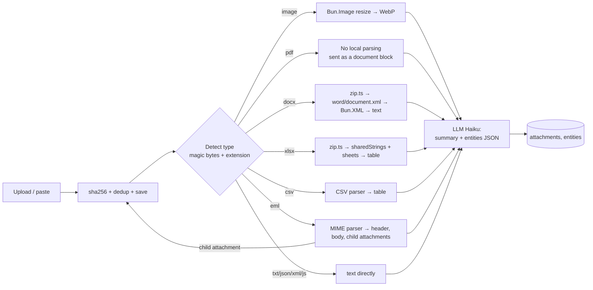

# 09 · Attachment Ingestion

## 1. Goal

Turn any attachment into: (1) a per-file **summary**, (2) searchable, quotable **derived text**,
(3) structured **entities** with their source location, without flooding the agent's context.

## 2. Pipeline



## 3. Rules per type

| Type | Local processing | What's sent to the LLM | Notes |
|---|---|---|---|
| PNG/JPG/WebP/GIF | Resize longest side to 1568 px, WebP q85, 320 px thumbnail | The resized image | HEIC/AVIF is supported by `Bun.Image` only on macOS/Windows; on Linux, ask for a conversion |
| PDF | Count pages (optional), keep the original | The full PDF document (≤ the API's page/size limit), or split by page range if large | Claude reads both text and visuals in the PDF |
| DOCX | Unzip, take `word/document.xml`, paragraphs + tables → Markdown | Markdown text | Images inside the DOCX are extracted as child attachments |
| XLSX | Unzip, `xl/sharedStrings.xml` + `xl/worksheets/sheet*.xml` → a table per sheet | Column schema + a 30-row sample + per-column stats; the full data is kept for the `read_attachment` tool | Formulas: take the cached value |
| XLS (binary) | Not supported | — | UI: "Save as XLSX/CSV" |
| CSV | RFC 4180 parser (quoting, newlines inside cells), delimiter detection `,` `;` `\t` | Same as XLSX | Encoding: UTF-8, falling back to Windows-1252 via `TextDecoder` |
| EML | Header (From, To, Date, Subject), text/html body → text, attachments → child attachments (`parent_id`) | Header + body text | Reply threads: strip repeated quoted content |
| MSG | Not natively supported in v1 | — | UI: "Save the email as .eml" or enable the optional ADR |
| TXT/LOG/JSON/XML/JS | Directly | Text (truncated + summarized if > 50 KB) | Client `.js` files are also temporarily FTS-indexed |

## 4. LLM output (schema)

The `record_ingest_result` tool call:

```json
{
  "summary": "Email from finance: Vendor Bill VB-1042 has failed to approve since Sep 12, with the error 'Record has been changed'.",
  "language": "en",
  "entities": [
    { "type": "transaction_no", "value": "VB-1042", "locator": "body line 3", "confidence": 0.95 },
    { "type": "error_message", "value": "Record has been changed", "locator": "screenshot.png", "confidence": 0.9 },
    { "type": "error_code", "value": "RCRD_HAS_BEEN_CHANGED", "locator": "inferred", "confidence": 0.6 },
    { "type": "timestamp", "value": "2026-09-12", "locator": "Date header", "confidence": 0.8 },
    { "type": "role", "value": "A/P Clerk", "locator": "body line 5", "confidence": 0.7 }
  ],
  "questions_for_client": ["Does the error happen on every vendor bill, or only for a specific subsidiary?"]
}
```

- Entities are normalized (error codes uppercased, dates in ISO format, NetSuite URLs split into record type + id).
- `questions_for_client` is shown on the issue as a draft follow-up question to send back to the client.

## 5. Content security

- All text from attachments is wrapped in `<untrusted_content source="...">` in the prompt, with instructions that it is data, not a command.
- Links in emails are never opened automatically.
- Executable files/nested archives (a `.zip` inside an email) are not auto-extracted; they're stored and flagged.

## 6. Limits

| Parameter | Default |
|---|---|
| Size per file | 50 MB |
| Total per issue | 500 MB |
| PDF pages per call | per the API's limit (checked in Settings) |
| XLSX/CSV rows stored | unlimited (file); 30-row sample sent to the LLM |
